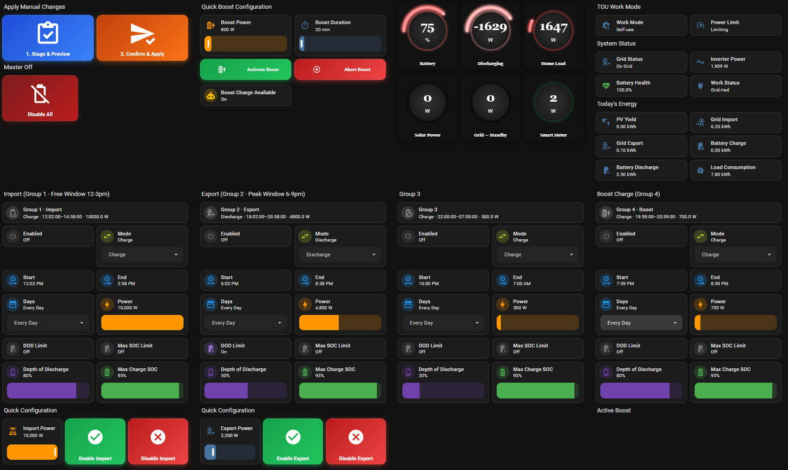
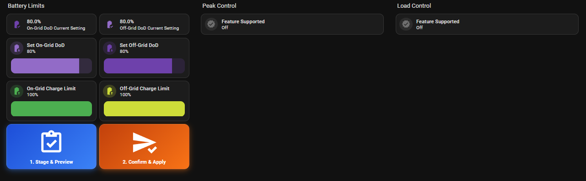

# Dyness Inverter Control

> A fork of [shopf/dyness_battery](https://github.com/shopf/dyness_battery), extended with full inverter control for the **Dyness Cygni 10.0HS-M8** (and Cygni HS series generally).
>
> ⚠️ Tested on a single setup. Use at your own risk — verify every setting before applying changes to live hardware.

---

## What this adds

On top of all upstream sensors, this fork adds **write control** via the Dyness v2 API — configuring the inverter directly from Home Assistant without touching the Dyness app.

All settings use a **two-step Stage → Confirm** flow to prevent accidental writes to live hardware. Staging shows a persistent notification preview of the proposed changes before anything is sent to the inverter.

### Configurable Polling Interval

Set how often HA polls the Dyness cloud API — configurable at setup and at any time via **Settings → Integrations → Dyness Inverter Control → Configure**.

| Option | Calls/hour (1 module) | Notes |
|--------|----------------------|-------|
| 2 min | ~40 | Aggressive — monitor logs for 429 errors |
| 3 min | ~27 | Recommended for 1 module |
| **5 min** | ~16 | **Default** |
| 10 min | ~8 | Conservative |
| 15 min | ~5 | Minimum recommended for 3+ modules |

With 3+ modules the interval is automatically raised (to 10 or 15 min) regardless of your setting, to stay within the Dyness API rate limit of ~60 calls/hour.

Changing the interval triggers an automatic integration reload — no HA restart needed.

### TOU (Time of Use) Schedule

Configure up to **4 charge/discharge groups** entirely within HA:

| Control | Options |
|---------|---------|
| Enabled | On / Off per group |
| Start / End Time | Time picker |
| Mode | Charge / Discharge |
| Days | Every Day, Weekdays, Weekends, Mon–Sun individually |
| Power Limit | 0 – 10,000 W (100 W steps) |
| DOD Limit | Enable switch + 0–100% slider |
| Max Charge SOC | Enable switch + 0–100% slider |

> **Note:** The Dyness API has no read-back endpoint for TOU schedules. Values shown are what HA last sent — they are restored across restarts via `RestoreEntity`. A warning is shown on the dashboard.

### Battery Limits

| Setting | Range |
|---------|-------|
| On-Grid Discharge Depth | 0–100% |
| Off-Grid Discharge Depth | 0–100% |
| On-Grid Charge Limit | 0–100% |
| Off-Grid Charge Limit | 0–100% |

### Peak Control *(feature-gated)*

Enable only if your inverter supports peak shaving (toggle the **Feature Supported** switch first):

| Setting | Options |
|---------|---------|
| Peak Control Enabled | On / Off |
| Trigger SOC | 0–100% |
| Time Range | Start + End time |
| Power Limit | 0–10,000 W |

### Load Control *(feature-gated)*

Enable only if a load relay is connected (toggle the **Feature Supported** switch first):

| Setting | Options |
|---------|---------|
| Load Switch | On / Off |
| Force Close Window | Start + End time |
| Force Close Off-Grid Only | On / Off |
| Always Close On Grid | On / Off |
| Relay Close SOC | 0–100% |
| Relay Open SOC | 0–100% |
| PV Power Threshold | 0–10,000 W |

---

## Example Dashboards

Two ready-to-import dashboards, matching the screenshots above, are included in [`docs/dashboards/`](docs/dashboards/):

| Dashboard | File | Shows |
|---|---|---|
| TOU Settings | [tou-dashboard.yaml](docs/dashboards/tou-dashboard.yaml) | All 4 TOU groups (Mushroom-styled controls), stage/confirm buttons, system status gauges |
| Battery Settings | [settings-dashboard.yaml](docs/dashboards/settings-dashboard.yaml) | Battery Limits, and feature-gated Peak Control / Load Control sections that only reveal their settings once **Feature Supported** is switched on |

### Required frontend add-ons (HACS)

Both dashboards use two custom card types that are **not** built into Home Assistant — install these via HACS → Frontend first, or the cards will show as "custom element doesn't exist":

| Add-on | HACS repository | Used for |
|---|---|---|
| Mushroom | [piitaya/lovelace-mushroom](https://github.com/piitaya/lovelace-mushroom) | Entity/select/number/template cards throughout both dashboards |
| button-card | [custom-cards/button-card](https://github.com/custom-cards/button-card) | The gradient Stage/Confirm/Enable/Disable action buttons |

### Importing

1. Install the two HACS frontend add-ons above and reload your browser.
2. In HA: **Settings → Dashboards → + Add Dashboard → New dashboard from scratch**, give it a name, then open it.
3. Click the pencil (Edit Dashboard) → **⋮ → Raw configuration editor**.
4. Delete the placeholder content and paste in the contents of the `.yaml` file.
5. Save. Repeat for the second dashboard if you want both.

### Entity ID prefix

Every entity in these dashboards is prefixed with `garage_dyness_cygni_` — `garage` is simply the name I gave my own device when I set it up, and `dyness_cygni` is the integration's domain. Your entities will use whatever name you gave your device instead of `garage`. After pasting the YAML in, use the Raw configuration editor's find-and-replace (or open the file in a text editor first) to swap `garage_dyness_cygni` for your own device's prefix — check **Developer Tools → States** and filter for `dyness_cygni` to find it.

### Optional extras on the TOU dashboard

The TOU dashboard also includes a handful of buttons and sliders that call into **personal automation examples of mine** (a GloBird "ZeroHero" TOU-scheduling setup and a manual battery boost-charge routine) — these are not part of the integration and are not included in this repo. Without matching helpers, the buttons below simply do nothing when pressed (they don't error):

| Entity | Type | Used by |
|---|---|---|
| `input_number.tou_import_power` / `tou_export_power` / `tou_boost_power` / `tou_boost_duration` | Helper (Number) | Power/duration sliders on the Enable Import/Export and Boost Charge cards |
| `input_button.tou_apply_globird_zerohero_optimal` / `tou_export_enable_6_9pm` / `tou_import_disable` / `tou_export_disable` / `tou_disable_all_groups` / `battery_boost_charge_5000w` / `abort_boost_charge` | Helper (Button) | The gradient action buttons in those same sections |
| `automation.dyness_battery_boost_charge_5000w_1hr` | Automation | "Boost Charge Running" status tile |

Either create matching helpers (**Settings → Devices & Services → Helpers → + Create Helper**) and wire up your own automations behind them, or just delete those specific cards from the Raw configuration editor after importing — the core TOU group controls (Groups 1–4, Stage & Preview, Confirm & Apply) work standalone with no extra setup.

## Installation (this fork)

1. In HACS → **Integrations** → **⋮** → **Custom repositories**
2. Add: `https://github.com/aistuartai/dyness_battery_stu` — Category: **Integration**
3. Install **Dyness Inverter Control**, restart HA
4. **Settings** → **Devices & Services** → **Add Integration** → search **Dyness Inverter Control**
5. Enter your **API ID** and **API Secret** from [ems.dyness.com](https://ems.dyness.com/login) → Developer Center → API Management

---

## Known quirks

| Issue | Detail |
|-------|--------|
| API boolean inversion | PDF documents `0=On, 1=Off` but actual API is `0=Off, 1=On` for all on/off fields |
| No TOU read-back | `/v2/GetWorkModeSetting` does not exist — entities persist last-sent values via `RestoreEntity` |
| `time.py` stdlib collision | HA platform named `time.py` shadows Python stdlib — coordinator uses `asyncio.get_event_loop().time()` instead of `time.monotonic()` |
| Peak/Load feature gates | These features are not available on all inverter configurations — enable the **Feature Supported** switch only if your hardware supports it |

---

## Credits

All core architecture, API handling, schema detection, and multi-device support is the work of **[shopf](https://github.com/shopf/dyness_battery)**. This fork adds Cygni-specific sensor patches and the full write-control layer on top.

---

## License

MIT — see [LICENSE](LICENSE). Original copyright © shopf.
